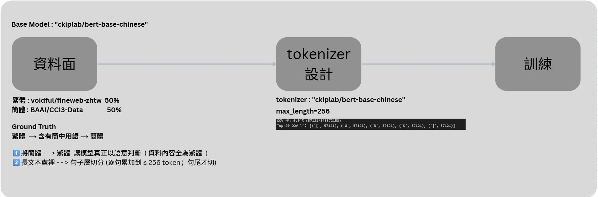

# BERT Chinese Traditional-Simplified Classifier

A modular pipeline for labeling Chinese text as **Simplified**, **Traditional**, or **Hybrid**. The project provides command line tools for dataset creation, tokenization, and BERT fine‑tuning.

---

## Features

- **Configurable dataset builder** (`data_prepare.py`)
- **Tokenization & train/val split utility** (`tokenizer_util.py`)
- **Robust BERT training CLI** (`train.py`)
- Evaluation and inference helpers
- **Interactive notebook demo** (`bert_test_notebook.ipynb`)

---

## Project Structure

```
bert-base-chinese-traditional-classifier/
├── assets/                # images and diagrams
├── src/                   # CLI tools and utilities
│   ├── data_prepare.py
│   ├── tokenizer_util.py
│   ├── train.py
│   ├── evaluate.py
│   ├── push_to_hub.py
│   └── test_inference.py
├── requirements.txt
├── bert_test_notebook.ipynb
└── README.md
```

## Script Design Details

Each script follows the single-responsibility principle and can be run independently via the CLI:

- **data_prepare.py** – Extracts and cleans data based on the config, outputting a Parquet file.
- **tokenizer_util.py** – Encodes text into a datasets.DatasetDict and splits it into train/val sets.
- **train.py** – Fine-tunes the model with Hugging Face Trainer and logs results to W&B.
- **evaluate.py** – Produces a classification report and confusion matrix.
- **test_inference.py** – Generates random samples and validates model predictions.
- **push_to_hub.py** –  Uploads the trained model to the Hugging Face Hub.


---

## Installation

```bash
python -m venv .venv
source .venv/bin/activate
pip install -r requirements.txt
```

---

## Quick Start

First, log into your Hugging Face and Weights and Biases accounts as follows:

```shell
huggingface-cli login
wandb login
```

### 1. Build the Dataset

Use the parameter driven dataset builder. CLI flags or a YAML/JSON config may override any hyper‑parameter.

```bash
python data_prepare.py \
    --rows 200000 \
    --out_dir data_cache_v2 \
    --min_zh_ratio 0.2
# or
python data_prepare.py --config configs/cci3.yaml
```

### 2. Tokenize & Split

```bash
python tokenizer_util.py \
  --input fineweb.parquet \
  --out_dir data_cache_v2 \
  --model ckiplab/bert-base-chinese \
  --max_len 256 --stride 128 --test_size 0.2
```

### 3. Train the Model

```bash
python train.py -d data_cache_v2 -o ckpt --rows 5000 \
  --project myproj --run debug-5k
```

### 4. Evaluate & Inference

Run `evaluate.py` or `test_inference.py` for reporting and prediction demos.

### 5. Upload to Hugging Face

```python
from src.push_to_hub import push_model
push_model(repo_id="renhehuang/bert-base-chinese-traditional-classifier-v3", model_dir="./model_ckpt")
```

### 6. Interactive Notebook

Open `bert_test_notebook.ipynb` to run through the full pipeline in a Jupyter environment.
Or you can just go to the Colab and [try the pipeline.](https://colab.research.google.com/drive/1OSF3l-n60sHW0Z0kuwEpD_0zjKXxOk3Q?usp=sharing)

---

## CLI Argument Overview

The main scripts expose flexible command‑line flags via `argparse`. Below is
an overview of the available options for each entry point.

### `data_prepare.py`

- `--config` – YAML/JSON config file overriding defaults
- `--rows` – number of rows to sample from the sources
- `--out_dir` – output directory for the generated dataset
- `--out_name` – filename of the saved parquet (auto‑generated when omitted)
- `--min_len` – minimum text length after cleaning
- `--min_zh_ratio` – minimum Chinese character ratio
- `--max_tok` – maximum tokens per chunk
- `--tokenizer_name` – HF tokenizer to use for length checks
- `--sources` – inline JSON list to override dataset sources

### `tokenizer_util.py`

- `--input`/`-i` – path to Parquet/CSV or saved dataset directory
- `--out_dir`/`-o` – where to save the encoded `DatasetDict`
- `--model` – tokenizer model name
- `--max_len` – maximum sequence length
- `--stride` – stride size for overflow windows
- `--test_size` – validation split ratio
- `--no_raw` – skip saving raw train/val parquet files

### `train.py`

- `-d`, `--dataset_dir` – path to a tokenized `DatasetDict`
- `-o`, `--output_dir` – directory for checkpoints and outputs
- `--rows` – sample subset size (`N` or `start-end`)
- `--num_labels` – number of classification labels
- `--batch_size` – per-device batch size
- `--grad_accum` – gradient accumulation steps
- `--epochs` – total training epochs
- `--early_stop` – early stopping patience
- `--project` – Weights & Biases project name
- `--run` – Weights & Biases run name
- `--no_wandb` – disable Weights & Biases logging
- `--model` – pretrained model to fine‑tune

